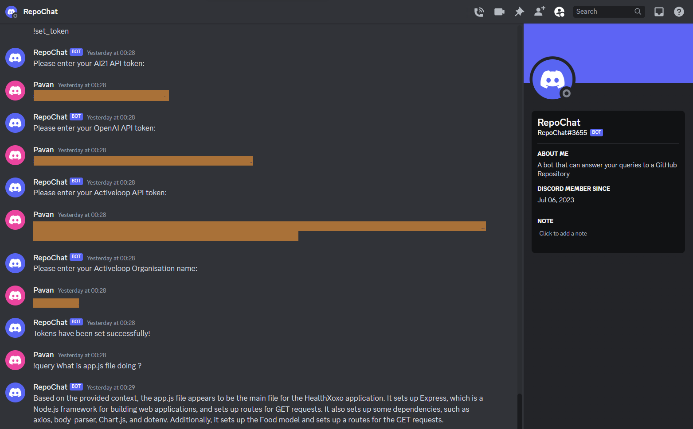

# RepoBot

RepoBot is a Discord bot designed to simplify GitHub exploration and collaboration within Discord communities. While still in development, RepoBot aims to provide a seamless user experience by enabling users to interact with GitHub repositories directly from Discord.

## Usage

1. Invite RepoBot to your Discord server.
2. Direct Message (DM) RepoBot to interact with it.
3. Use the following commands in DM to communicate with RepoBot:

`!set_token`: Prompts you to add each token one at a time  
`!git_link <repository_link>`: Clones and load the contents to vector database  
`!delete_git`: Deletes the current Git repository present  
`!query <question>`: Generates response to the question  




**Environment Variables**

Before running RepoBot, make sure to set up the required environment variables by creating a `.env` file in the root directory of the project. The `.env` file should contain the following variables:

```
DISCORD_TOKEN=YOUR_DISCORD_TOKEN
MONGO_DB_USER=YOUR_MONGO_DB_USERNAME
MONGO_DB_PASSWORD=YOUR_MONGO_DB_PASSWORD
```

Replace `YOUR_DISCORD_TOKEN`, `YOUR_MONGO_DB_USERNAME`, and `YOUR_MONGO_DB_PASSWORD` with your respective values.

Note: The `.env` file should not be shared or committed to public repositories, as it contains sensitive information.

Note: RepoBot currently only supports direct messages and is not fully functional in Discord servers. Further updates are planned to enhance the user experience and extend the bot's capabilities within servers.

## Future Development
- Expanded Server Functionality: Enable RepoBot commands to function within Discord servers.
- Enhanced User Experience: Improve bot interactions and responsiveness.
- Additional Features: Implement more capabilities for in-depth repository exploration and collaboration.

## Contributions
Contributions to RepoBot are welcome! Feel free to fork the repository, make changes, and submit a pull request.